# UT3.PC02

En esta práctica crearemos un repositorio local que conectaremos con uno en remoto en Github, trabajaremos con *.gitignore*, usaremos la firma GPG para subir un commit y por último utilizaremos *gitleaks* para verificar que el repositorio no tenga fugas.

## Conectar repositorio local y remoto y subir un *.gitignore*.

Comenzaremos creando el repositorio local:

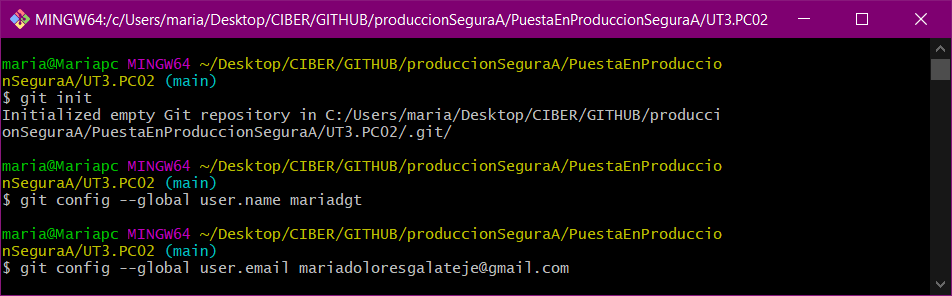

Creamos en la carpeta un .log para comprobar que el .gitignore funciona junto con otro documento:

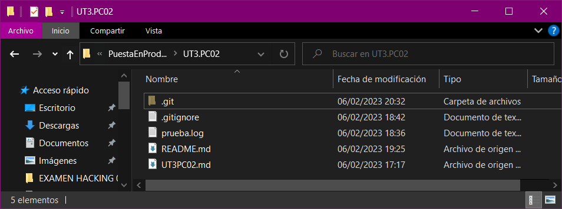

Y añadimos y hacemos el commit:

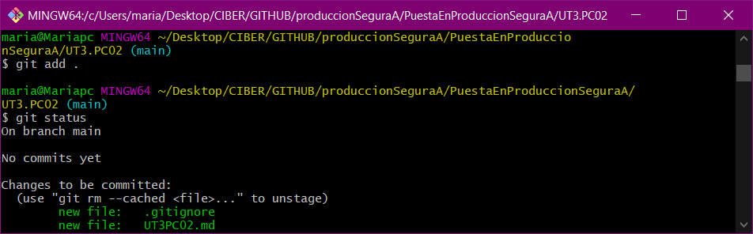

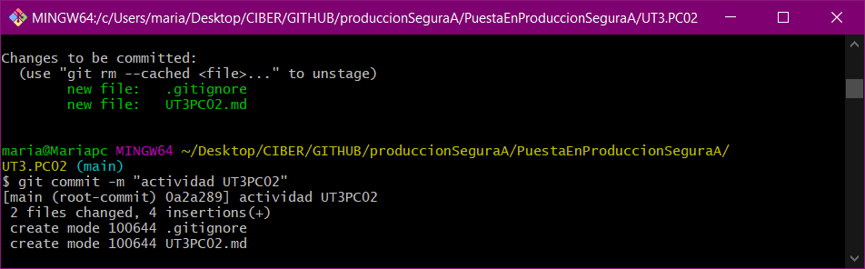

Una vez realizado esto vamos a enlazarlo con el repositorio remoto, para ello creamos el repositorio y copiamos la URL, nos vamos al bash y escribimos el siguiente comando, con *git remote -v* comprobamos que nos ha funcionado:

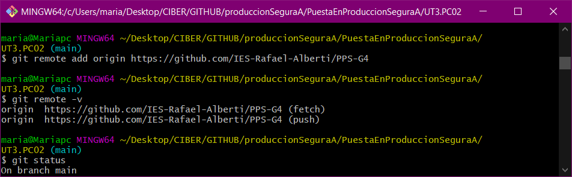

Creamos una rama propia y subimos lo que tenemos en local:

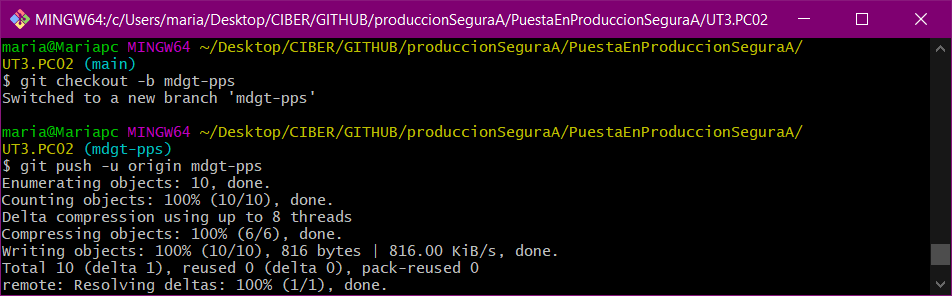

Nos vamos al navegador y comprobamos que se ha subido correctamente:

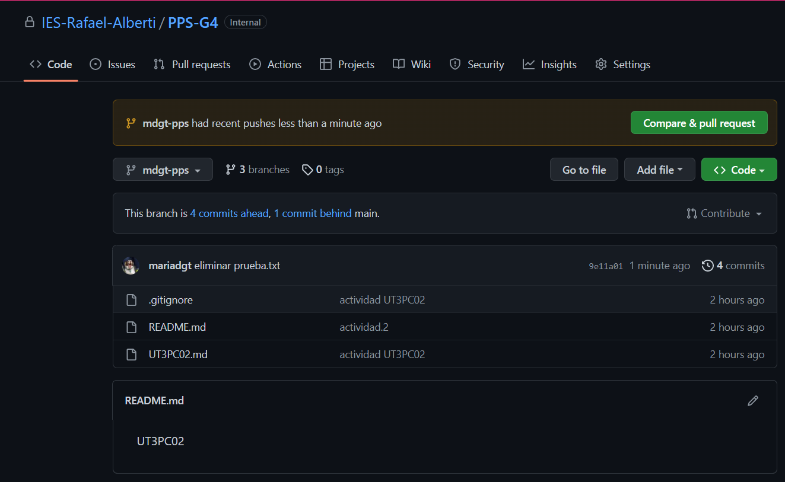

## Firma GPG.

Primero generaremos una nueva firma, para ello instalamos las [herramientas de línea de comandos de GPG](https://www.gnupg.org/download/), nos vamos al bash y escribimos el siguiente comando:

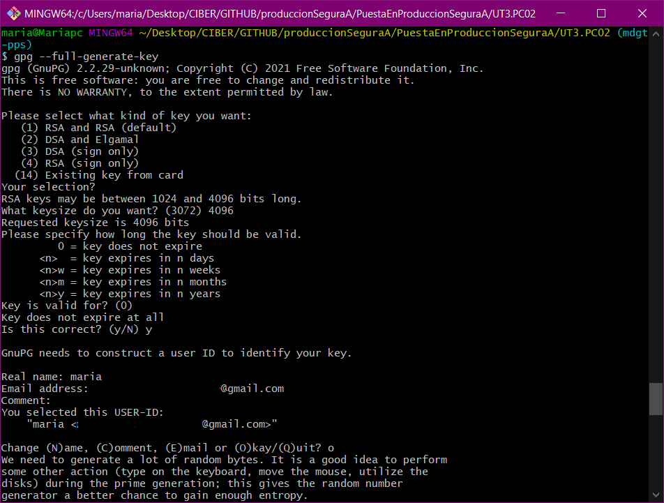

Listamos en formato largo las claves y copiamos su id, ejecutamos el siguiente comando y lo copiamos para poder agregarlo a la cuenta:

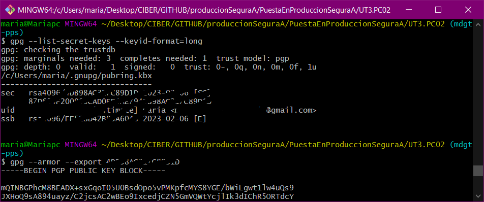

Ahora nos vamos al apartado de *settings>SSH and GPG keys>new GPG key*  y **copiamos ahi la clave:

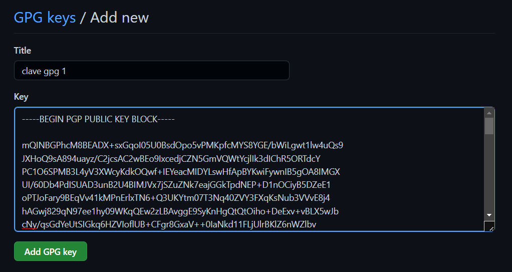

Y ya podemos comprobar que está creada:

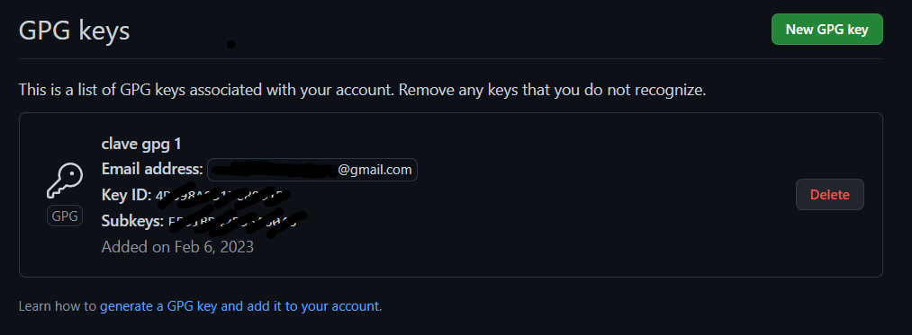

Añadimos la clave a la configuración con el siguiente comando:

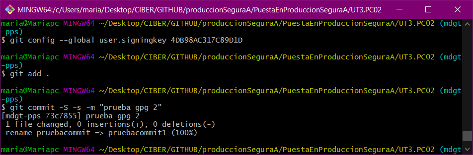

Realizamos un commit y nos pedirá la contraseña para la verificación:

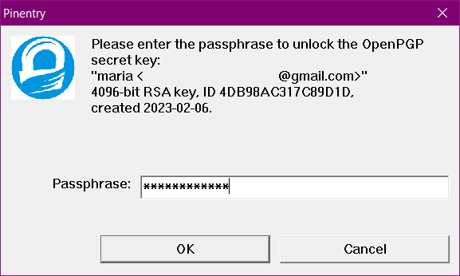

Una vez realizado nos vamos a Github y comprobamos que efectivamente el commit realizado está verificado:

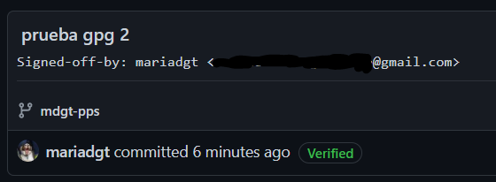

## Gitleaks.

Para empezar nos descargamos gitleaks, en mi caso al usar windows me descargo el .exe del siguiente [enlace](https://github.com/zricethezav/gitleaks/releases).

Realizamos un chequeo de los commit de nuestro repositorio local:

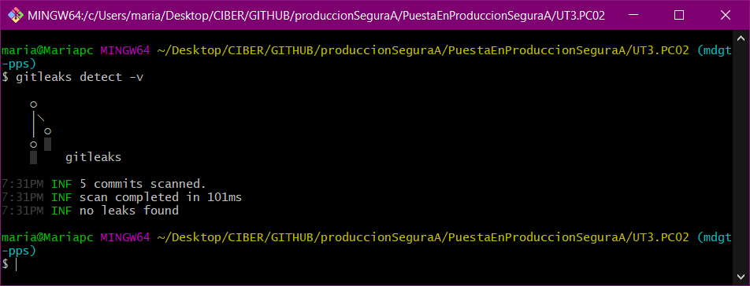

Podemos ver que no ha encontrado información sensible en ninguno de ellos.

Ahora vamos a comprobar que nos encuentre una clave, para ello creamos un archivo de variables de entorno y añadimos una clave de AWS por ejemplo:

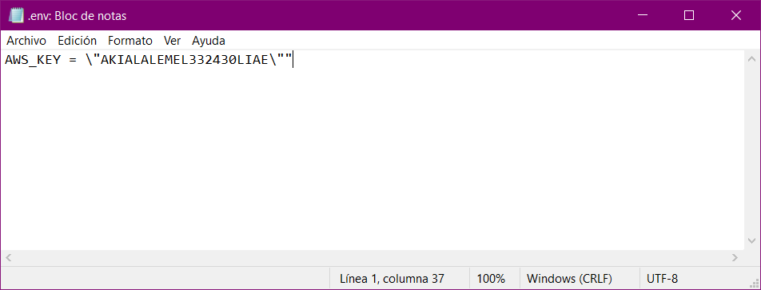

Lo añadimos y hacemos el commit:

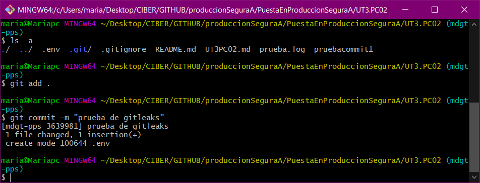

Volvemos a ejecutar el comando para el chequeo y vemos que nos ha dado un warn avisando de que ha encontrado algo:

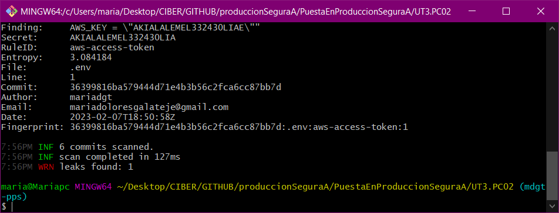

Para evitar que suba este archivo lo añadiremos a *.gitignore*: 

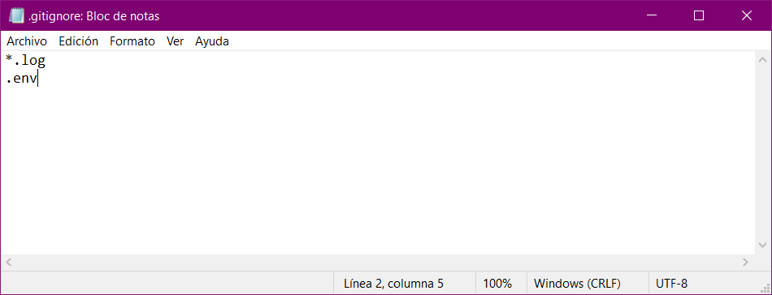

## Hook.

Vamos a automatizar esto para que se ejecute siempre antes de realizar un commit, para ello nos vamos a la ruta *.git\hooks* y creamos el siguiente archivo ocn el nombre *pre-commit*:

```bash
gitleaksEnabled=$(git config --bool hoks.gitleaks)
if [ "$gitleaksEnabled" = "true" ]; then
    gitleaks --verbose
    if [ $? -eq 1 ]; then
        echo "Error: gitleaks has detected sensitive information in your changes"
        echo "If you know what you are doing you can disable this check using:"
        echo " git config hooks.gitleaks false"
    exit 1
    fi
fi
```

Le damos premiso de ejecución y configuramos el booleano de hooks a true:

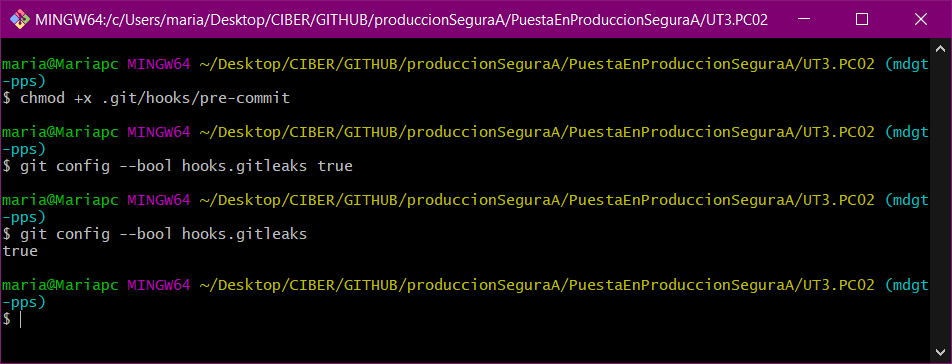

Para probarlo vamos a crear un fichero simulando que contiene un par de claves:

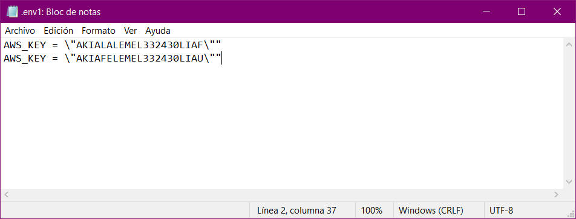

Lo añadimos y hacemos el commit, ahora es cuando hooks nos debería de parar y avisar:

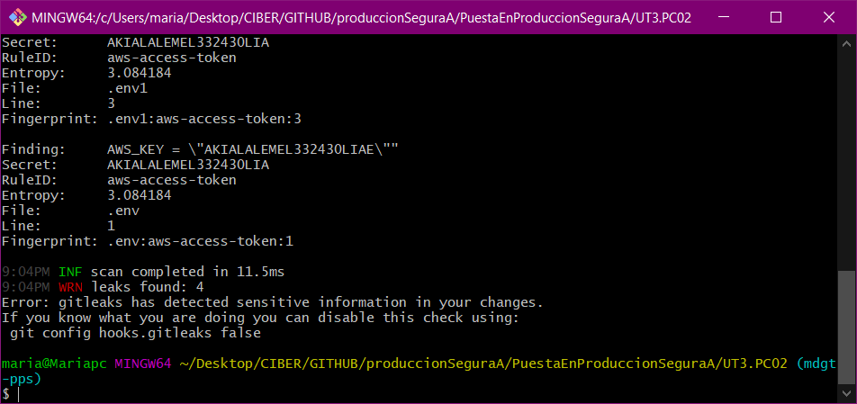

Y ya tendríamos un poco más de seguridad en git.